# Research Workflow Diagram

This document illustrates the iterative research process used by the Ollama Deep Researcher.

## High-Level Process Flow

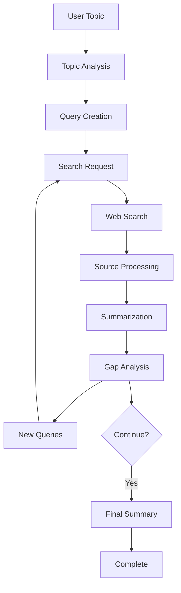

## Component Details

### 1. Initial Processing

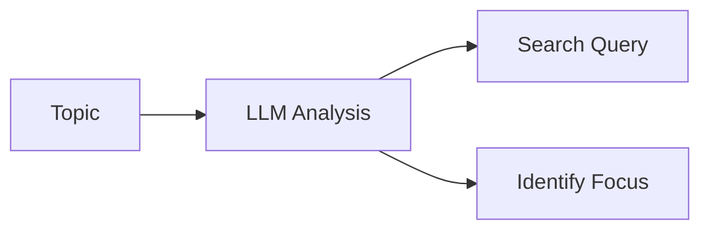

### 2. Search and Collection

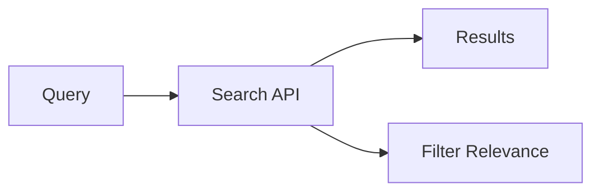

### 3. Processing Pipeline

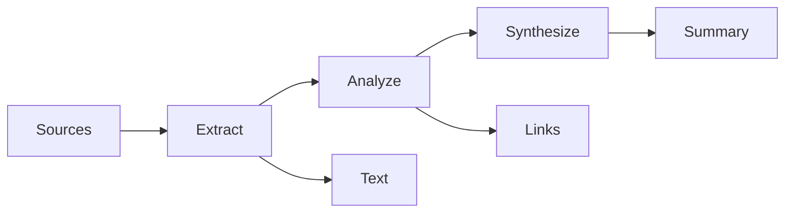

## State Machine

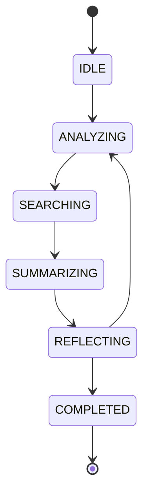

## Data Flow

### Input Processing

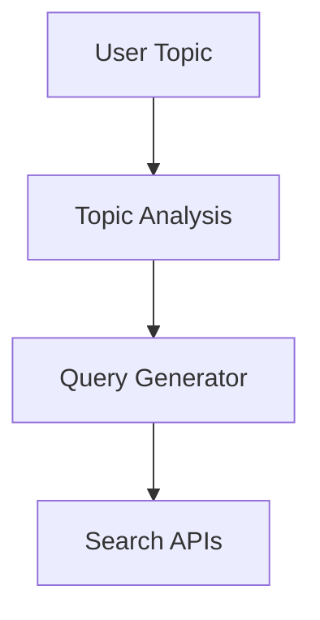

### Research Loop

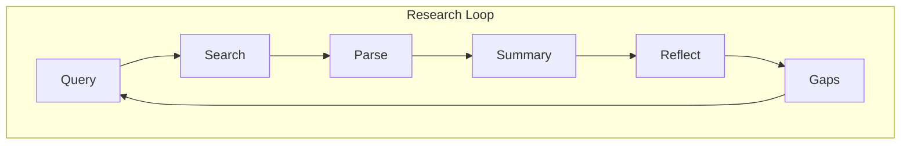

### Output Generation

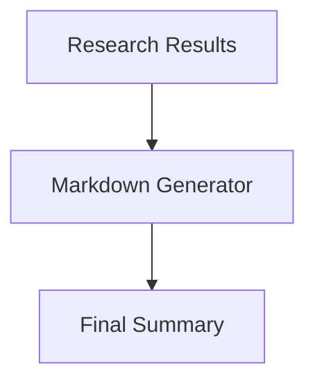

## Integration Points

### Ollama Integration

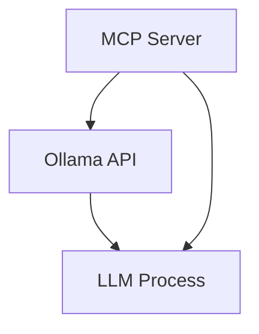

### Search API Integration

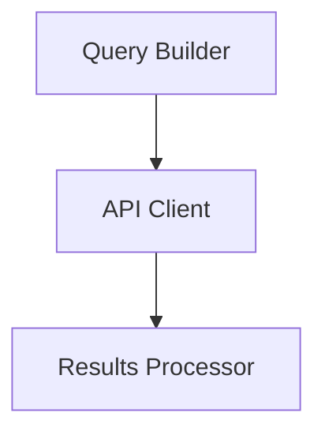

## Error Handling Flow

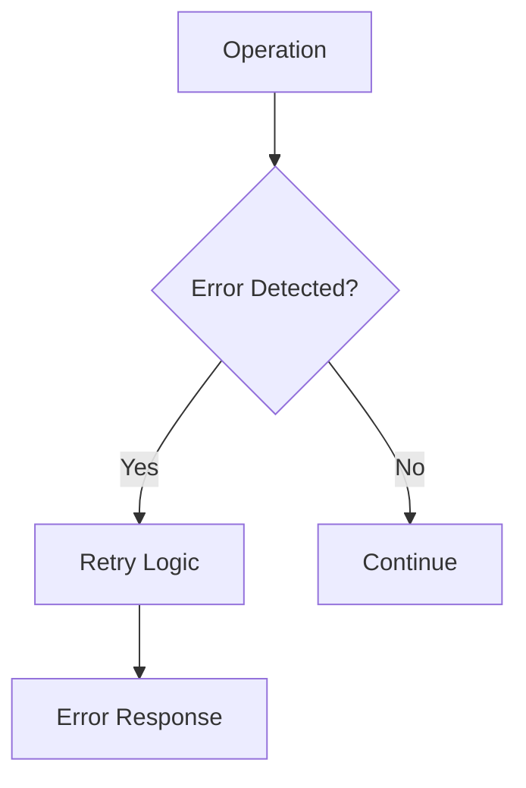

## Research Cycle Details

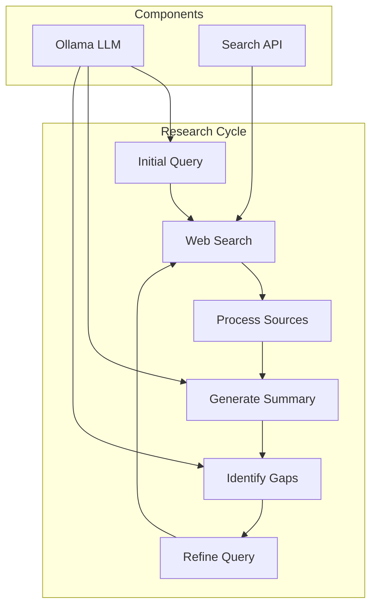

## System Integration Overview

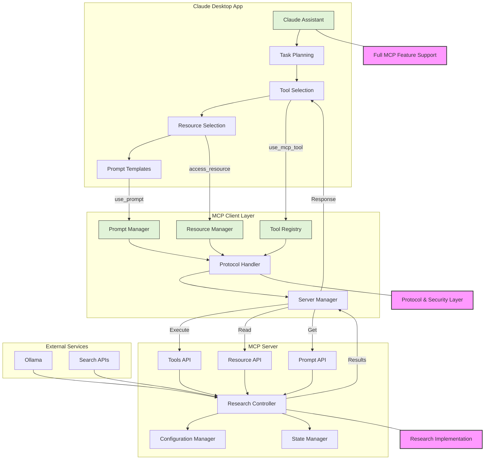

## Orchestration Details

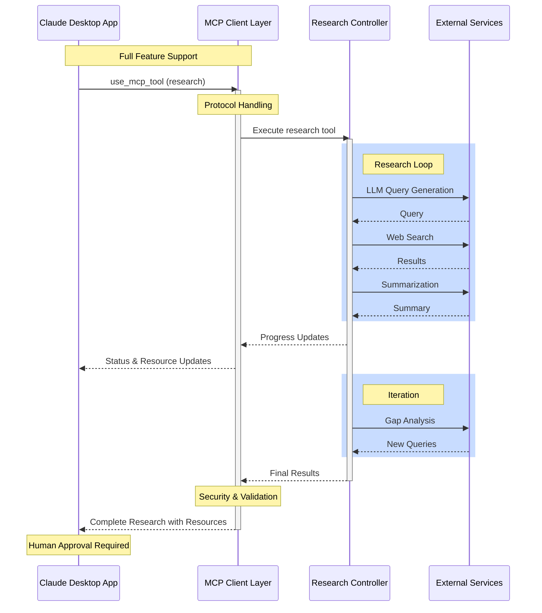

## Feature Support Matrix

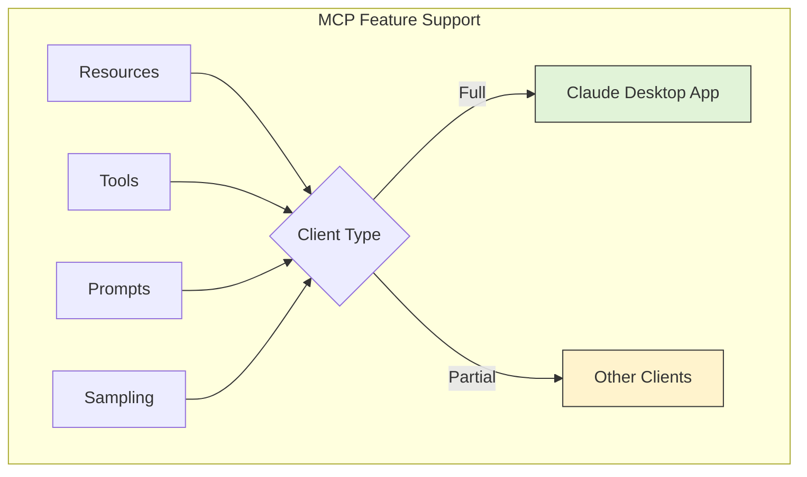
