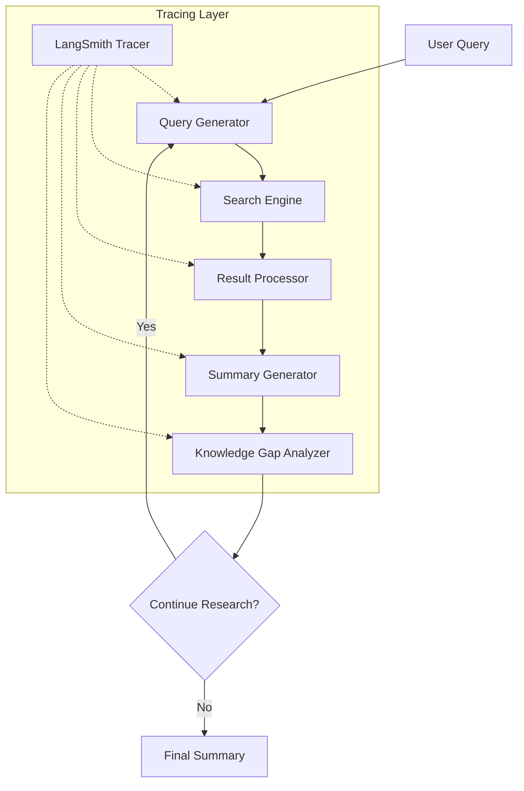

# Ollama Deep Researcher Architecture

## Overview

The Ollama Deep Researcher is a Model Context Protocol (MCP) server that provides deep research capabilities using local LLMs via Ollama. The system integrates multiple components to enable efficient research, tracing, and monitoring.

## Core Components

### 1. Research Engine
- Implements iterative research workflow using LangGraph
- Manages state transitions between research phases
- Handles query generation and result synthesis

### 2. Search Integration
- Supports multiple search providers (Perplexity, Tavily)
- Abstracts search API interactions
- Handles rate limiting and error recovery

### 3. LLM Integration
- Connects to Ollama for local LLM access
- Manages model loading and inference
- Handles prompt engineering and response parsing

### 4. Tracing System
- LangSmith integration for comprehensive tracing
- Monitors all LLM operations and search requests
- Provides performance metrics and debugging tools

## Data Flow



## Key Features

### 1. Configurable Research Parameters
- Maximum research loops
- LLM model selection
- Search API selection
- Timeout settings

### 2. Performance Monitoring
- Operation latency tracking
- Resource utilization metrics
- Error rate monitoring
- Query performance analysis

### 3. Error Handling
- Graceful degradation
- Automatic retries
- Fallback strategies
- Clear error reporting

## Implementation Details

### Research Workflow
1. Query Generation
   - Uses LLM to create targeted search queries
   - Incorporates context from previous iterations
   - Tracked via LangSmith for optimization

2. Web Search
   - Configurable search provider
   - Result deduplication
   - Source validation
   - Performance monitoring

3. Result Synthesis
   - Incremental summary updates
   - Source tracking
   - Citation management
   - Quality metrics

### Tracing Implementation

The system uses LangSmith for comprehensive tracing:

1. Operation Tracing
   ```python
   @traceable
   def tavily_search(query, include_raw_content=True, max_results=3):
       tavily_client = TavilyClient()
       return tavily_client.search(query, 
                            max_results=max_results, 
                            include_raw_content=include_raw_content)
   ```

2. Performance Monitoring
   - Response time tracking
   - Resource utilization
   - Error rate monitoring
   - Query optimization

3. Debug Capabilities
   - Step-by-step workflow tracing
   - Input/output inspection
   - Error context capture
   - Performance bottleneck identification

## Configuration

### Environment Variables
```bash
LANGSMITH_TRACING=true
LANGSMITH_ENDPOINT="https://api.smith.langchain.com"
LANGSMITH_API_KEY="your-api-key"
LANGSMITH_PROJECT="ollama-deep-researcher-mcp-server"
TAVILY_API_KEY="tvly-your-key"  # Include tvly- prefix
PERPLEXITY_API_KEY="pplx-your-key"
```

### Default Settings
```json
{
  "maxLoops": 3,
  "llmModel": "deepseek-r1:1.5b",
  "searchApi": "perplexity",
  "timeout": 300
}
```

## Future Enhancements

1. Advanced Tracing
   - Custom trace aggregation
   - Advanced performance analytics
   - Automated optimization suggestions

2. Search Optimization
   - Dynamic provider selection
   - Improved result ranking
   - Enhanced deduplication

3. LLM Improvements
   - Model performance tracking
   - Automated prompt optimization
   - Response quality metrics

4. System Scalability
   - Parallel research workflows
   - Distributed tracing
   - Enhanced resource management
