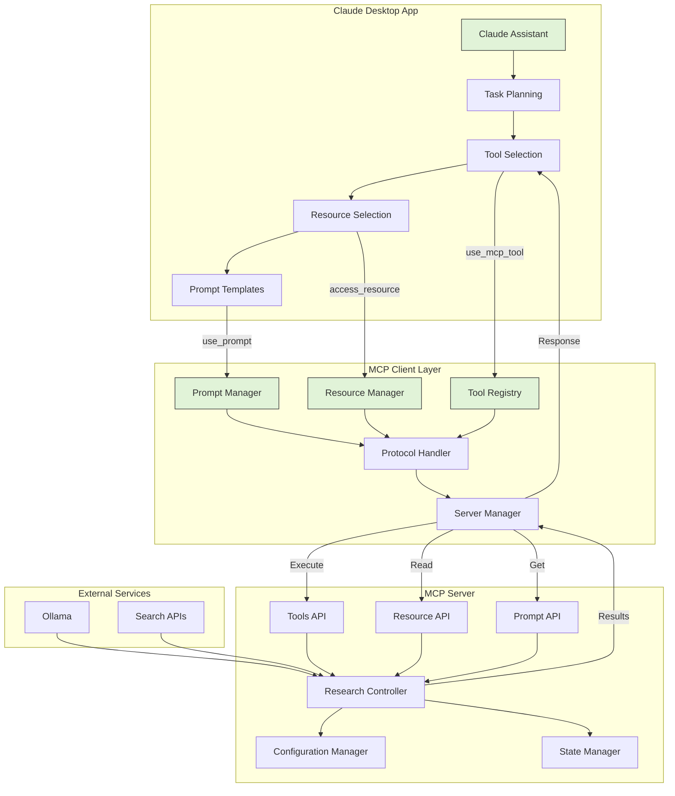

# MCP Server: Ollama Deep Researcher

This is a Model Context Protocol (MCP) server adaptation of [LangChain Ollama Deep Researcher](https://github.com/langchain-ai/ollama-deep-researcher). It provides the deep research capabilities as MCP tools that can be used within the model context protocol ecosystem, allowing AI assistants to perform in-depth research on topics using local LLMs via Ollama.

## Core Functionality

The server provides research capabilities through MCP tools and resources, using any LLM hosted by [Ollama](https://ollama.com).

### Research Process
Given a topic, it will:

1. Generate a web search query
2. Gather web search results via [Tavily](https://www.tavily.com/) or [Perplexity API](https://www.perplexity.ai/hub/faq/pplx-api)
3. Summarize the search results
4. Reflect on the summary to examine knowledge gaps
5. Generate new search queries to address the gaps
6. Iteratively improve the summary through multiple research cycles
7. Provide a final markdown summary with all sources used


## Prerequisites

- Node.js (for running the MCP server)
  - Download and install from https://nodejs.org/
  - Ensure Node.js is added to your system PATH
- Python 3.10 or higher
- Compute (CPU/GPU) capable of running your selected Ollama model
- At least 8GB of RAM for running larger language models
- Required API keys:
  - Tavily API key (get one at https://tavily.com)
  - Perplexity API key (get one at https://perplexity.ai)
  - LangSmith API key (get one at https://smith.langchain.com) for tracing and monitoring

Make sure you can run Node.js and npm from your terminal/command prompt. You can verify your installations with:

```bash
node --version
npm --version
python --version
```

If these commands fail, you may need to:
1. Restart your terminal/computer after installation
2. Add Node.js to your system PATH:
   - Windows: Edit system environment variables → Environment Variables → Path → Add Node.js installation directory
   - macOS/Linux: Usually handled by the installer

## Installation

### Option 1: Standard Installation

1. Download and install [Ollama](https://ollama.com/download) for your platform

2. Clone this repository and install dependencies:
```bash
git clone https://github.com/Cam10001110101/mcp-server-ollama-deep-researcher
cd mcp-server-ollama-deep-researcher
npm install
```

3. Install Python dependencies:

First, install uv (recommended for better performance and dependency resolution):
```bash
# Windows
pip install uv

# macOS/Linux
pip3 install uv
```

Then install project dependencies using pyproject.toml:
```bash
uv pip install .
```

Note: This will install the project in editable mode with all dependencies specified in pyproject.toml. If you prefer pip:
```bash
pip install .  # Windows
pip3 install .  # macOS/Linux
```

4. Build the TypeScript code:
```bash
npm run build
```

5. Pull a local LLM from [Ollama](https://ollama.com/search):
```bash
ollama pull deepseek-r1:8b
```

### Option 2: Docker Installation

You can also run the MCP server using Docker, which simplifies the setup process.

1. Download and install [Docker](https://www.docker.com/products/docker-desktop/) for your platform

2. Clone this repository:
```bash
git clone https://github.com/Cam10001110101/mcp-server-ollama-deep-researcher
cd mcp-server-ollama-deep-researcher
```

3. Create a `.env` file with your API keys (you can copy from `.env.example`):
```bash
cp .env.example .env
# Edit the .env file with your API keys
```

4. Make the helper script executable:
```bash
chmod +x run-docker.sh
```

5. Build and run the Docker container:
```bash
./run-docker.sh start
```

6. Ensure Ollama is running on your host machine:
```bash
ollama pull deepseek-r1:8b  # or your preferred model
ollama serve
```

The helper scripts provide several commands:

For macOS/Linux (using run-docker.sh):
- `./run-docker.sh start` - Build and start the Docker container
- `./run-docker.sh stop` - Stop the Docker container
- `./run-docker.sh restart` - Restart the Docker container
- `./run-docker.sh logs` - Show logs from the Docker container
- `./run-docker.sh status` - Check the status of the Docker container
- `./run-docker.sh help` - Show help message

For Windows (using run-docker.bat):
- `run-docker.bat start` - Build and start the Docker container
- `run-docker.bat stop` - Stop the Docker container
- `run-docker.bat restart` - Restart the Docker container
- `run-docker.bat logs` - Show logs from the Docker container
- `run-docker.bat status` - Check the status of the Docker container
- `run-docker.bat help` - Show help message

Note: The Docker container is configured to connect to Ollama running on your host machine. If you want to run Ollama in a container as well, uncomment the Ollama service in the docker-compose.yml file.

## Client Configuration

Add the server to your MCP client configuration:

For Claude Desktop App:
- macOS: `~/Library/Application Support/Claude/claude_desktop_config.json`
- Windows: `%APPDATA%\Claude\claude_desktop_config.json`

For Cline (VS Code Extension):
- Windows: `%APPDATA%\Code\User\globalStorage\saoudrizwan.claude-dev\settings\cline_mcp_settings.json`
- macOS: `~/Library/Application Support/Code/User/globalStorage/saoudrizwan.claude-dev/settings/cline_mcp_settings.json`
- Linux: `~/.config/Code/User/globalStorage/saoudrizwan.claude-dev/settings/cline_mcp_settings.json`

### Option 1: Standard Installation Configuration

```json
{
  "mcpServers": {
    "ollama-deep-researcher": {
      "command": "node",
      "args": ["path/to/mcp-server-ollama-deep-researcher/build/index.js"],
      "env": {
        "LANGSMITH_TRACING": "true",
        "LANGSMITH_ENDPOINT": "https://api.smith.langchain.com",
        "LANGSMITH_API_KEY": "your-langsmith-key",
        "LANGSMITH_PROJECT": "ollama-deep-researcher-mcp-server",
        "TAVILY_API_KEY": "your-tavily-key",  // Include tvly- prefix
        "PERPLEXITY_API_KEY": "your-perplexity-key",
        "PYTHONPATH": "path/to/mcp-server-ollama-deep-researcher/src"
      }
    }
  }
}
```

Note: Replace paths with absolute paths for your system:
- Windows: Use `C:\\Users\\username\\path\\to\\mcp-server-ollama-deep-researcher`
- macOS/Linux: Use `/Users/username/path/to/mcp-server-ollama-deep-researcher`

For macOS/Linux, you may also want to add:
```json
"PYTHONUNBUFFERED": "1"
```

### Option 2: Docker Installation Configuration

If you're using the Docker container, you can configure the MCP client to connect to the running container:

```json
{
  "mcpServers": {
    "ollama-deep-researcher": {
      "command": "docker",
      "args": ["exec", "-i", "ollama-deep-researcher-mcp", "node", "build/index.js"],
      "env": {}
    }
  }
}
```

This configuration assumes the Docker container is running. The environment variables are already set in the Docker container, so you don't need to specify them in the MCP client configuration.

## Tracing and Monitoring

The server integrates with LangSmith for comprehensive tracing and monitoring of the research process:

1. **Operation Tracing**:
   - All LLM interactions are traced
   - Web search operations are monitored
   - Research workflow steps are tracked

2. **Performance Monitoring**:
   - Response times for each operation
   - Success/failure rates
   - Resource utilization

3. **Debugging and Optimization**:
   - Detailed traces for troubleshooting
   - Performance bottleneck identification
   - Query optimization insights

Access all traces at https://smith.langchain.com under your configured project name.

## MCP Resources

Research results are automatically stored as MCP resources, enabling:

1. **Persistent Access**
   - Results accessible via `research://{topic}` URIs
   - Automatic storage of completed research
   - JSON-formatted content with metadata

2. **Resource Panel Integration**
   - Research appears in MCP client's resource panel
   - Easy access to past research topics
   - Timestamp and description for each result

3. **Context Management**
   - Efficient reuse of research in conversations
   - Reduced token usage through resource references
   - Selective inclusion of research context

## Available Tools

### Configure

- **maxLoops**: Number of research iterations (1-5)
- **llmModel**: Ollama model to use (e.g., "deepseek-r1:1.5b", "llama3.2")
- **searchApi**: Search API to use ("perplexity" or "tavily")

Configure research parameters.
```json
{
  "name": "configure",
  "arguments": {
    "maxLoops": 3,
    "llmModel": "deepseek-r1:1.5b",
    "searchApi": "tavily"
  }
}
```

### Research
Research any topic using web search and LLM synthesis.
```json
{
  "name": "research",
  "arguments": {
    "topic": "Austin LangChain, aimug.org"
  }
}
```

### Get status
Get the current status of ongoing research.
```json
{
  "name": "get_status",
  "arguments": {
    "_dummy": "dummy"
  }
}
```

## Prompting

### Using the Default Search API, Model, and Max Iterations (loops)
Prompt Example: "research AI-First Applications"
### Change Default Config and Start Research
Synatx: `configure with <searchapi> and <model> then research <topic>`  
Prompt Example: "Configure with perplexity and deepseek-r1:8b then research AI-First Applications"

# The Ollama Research Workflow

The research process is inspired by [IterDRAG](https://arxiv.org/html/2410.04343v1#:~:text=To%20tackle%20this%20issue%2C%20we,used%20to%20generate%20intermediate%20answers.). This approach decomposes a query into sub-queries, retrieves documents for each one, answers the sub-query, and then builds on the answer by retrieving docs for the second sub-query.

The process works as follows:

1. Given a user-provided topic, use a local LLM (via [Ollama](https://ollama.com/search)) to generate a web search query
2. Uses a search engine (configured for [Tavily](https://www.tavily.com/)) to find relevant sources
3. Uses LLM to summarize the findings from web search related to the user-provided research topic
4. Then, it uses the LLM to reflect on the summary, identifying knowledge gaps
5. It generates a new search query to address the knowledge gaps
6. The process repeats, with the summary being iteratively updated with new information from web search
7. It will repeat down the research rabbit hole
8. Runs for a configurable number of iterations

## Outputs

The output is a markdown file containing the research summary, with citations to all sources used during the research process.

All sources gathered during research are preserved and can be referenced in the final output:

## System Integration Overview



## Troubleshooting

Here are solutions to common issues you might encounter:

### Ollama Connection Issues

- Make sure Ollama is running: Execute `ollama list` in your terminal
- Try running ollama in terminal mode by closing the app (System Tray/Menu Bar), and executing `ollama serve`
- Check if Ollama is accessible at `localhost:11434`, `0.0.0.0:11434`, or `127.0.0.1:11434`

### API Key Issues

- Verify your API key is correctly set in the configuration file
- Verify your path arg points to the actual location of the index.js in this repo
- Ensure there are no extra spaces or quotes around the API key
- Check if your API key has sufficient credits/permissions

### MCP Server Issues

- Use the MCP Inspector for debugging:
```bash
npx @modelcontextprotocol/inspector node path/to/server/index.js --model llama3.2 --max-loops 3 --search-api tavily
```

### Docker Issues

- If you're having issues with the Docker container:
  - Check if the container is running: `docker ps`
  - View container logs: `docker logs ollama-deep-researcher-mcp`
  - Ensure your `.env` file contains valid API keys
  - Verify Ollama is running on your host machine and accessible from the container
  - If using host.docker.internal doesn't work, try using your host machine's IP address in the OLLAMA_BASE_URL environment variable
  - For network issues between containers, ensure they're on the same Docker network

- If you're running Ollama in a container:
  - Uncomment the Ollama service in docker-compose.yml
  - Ensure the Ollama container has enough resources allocated
  - Pull the model in the Ollama container: `docker exec -it ollama ollama pull deepseek-r1:8b`

### Build Issues

- If `npm run build` fails with "'node' is not recognized":
  1. Ensure Node.js is properly installed
  2. Add Node.js to your system PATH:
     - Windows: Edit system environment variables → Environment Variables → Path → Add Node.js installation directory
     - macOS/Linux: Usually handled by the installer
  3. Restart your terminal/computer
  4. Try running `node --version` to verify the installation

### Python Issues

Windows:
- Ensure Python is in your PATH
- Try using `python` instead of `python3`
- Check if pip is installed: `python -m pip --version`

macOS/Linux:
- Use `python3` instead of `python`
- Check if pip is installed: `python3 -m pip --version`
- You may need to install pip: `sudo apt install python3-pip` (Ubuntu/Debian) or `brew install python3` (macOS)

## Error Handling

The server provides clear error messages for:
- Missing or invalid API keys
- Configuration issues
- Search API problems
- LLM processing errors

## Enhancements Needed
- Tighter re-integration and validation of langgraph for additional interesting use cases.

## Architecture

For detailed information about the server's architecture and implementation, see [.context/index.md](.context/index.md).

## Glama.ai Badge
<a href="https://glama.ai/mcp/servers/r25SSxqOci">
  
</a>   

  


# Example Prompt and Output Transcript

## Prompt

```text
Configure with perplexity and deepseek-r1:8b then research AI-First Applications
```


## Configuration Output
```json
{
  "searchApi": "perplexity",
  "llmModel": "deepseek-r1:8b",
  "maxLoops": 3
}
```

## Ollama Researcher Output
```text
Research configuration updated:
Max Loops: 3
LLM Model: deepseek-r1:8b
Search API: perplexity

### Complete Research Results

**Updated Summary: AI-First Applications in Healthcare: Focus on PathAI**

1. **Design Principles**:
   - PathAI exemplifies a data-driven approach by leveraging extensive datasets to train advanced AI models like PLUTO.
   - Collaboration is central to their success, integrating technology into clinical workflows through partnerships with institutions such as Cleveland Clinic.

2. **Industry Transformations**:
   - In healthcare, PathAI has significantly impacted diagnostic accuracy and efficiency. Their foundation model, PLUTO, demonstrates superior performance in various pathology tasks, outperforming existing models while reducing costs.
   - Collaborations with leading institutions have facilitated the creation of digital pathology data networks, enhancing research and clinical care.

3. **Scalability and Performance**:
   - PathAI's PLUTO model offers enhanced efficiency and compactness, significantly reducing training and inference costs.
   - This innovation underscores their commitment to scalable and effective solutions in healthcare.

4. **Growth and Impact**:
   - PathAI's growth strategy includes strategic partnerships and collaborations, such as their partnership with Cleveland Clinic and acquisition by Quest Diagnostics.
   - These moves accelerate AI and digital pathology adoption, particularly in cancer diagnosis.

This summary highlights PathAI's contributions to healthcare through innovative technology and strategic collaborations, emphasizing their role in driving advancements and improving patient outcomes.

## Sources

### Perplexity Search 1
1. https://intelifaz.com/insights/ai-first-software-design
2. https://www.uxdesigninstitute.com/blog/how-to-design-for-ai-first-products/
3. https://vux.world/ai-design-principles/
4. https://www.leanware.co/insights/ai-first-apps
5. https://adamfard.com/blog/ai-ux-design-framework
6. https://www.sgh.com/insight/artificial-intelligence-best-practices/
7. https://www.index.dev/blog/generative-ai-application-design-principles
8. https://onstrategyhq.com/resources/ai-guiding-principles/
9. https://orangematter.solarwinds.com/2024/04/29/introducing-ai-by-design-principles-for-responsible-ai/
10. https://principles.design/examples/10-principles-for-design-in-the-age-of-ai

### Perplexity Search 2
1. https://cloud.google.com/transform/101-real-world-generative-ai-use-cases-from-industry-leaders
2. https://www.cloudera.com/resources/the-art-of-the-possible/ai-first-benefits-5-real-world-outcomes.html
3. https://builtin.com/artificial-intelligence/examples-ai-in-industry
4. https://www.uxforai.com/p/the-rise-of-ai-first-products
5. https://www.1051theblaze.com/ai-first-mobile-apps/
6. https://www.techtarget.com/searchenterpriseai/tip/The-history-of-artificial-intelligence-Complete-AI-timeline
7. https://gitnation.com/contents/demystifying-ai-first-building-applications-for-the-future
8. https://fptsoftware.com/resource-center/blogs/the-ai-first-future-challenges-and-opportunities
9. https://online.maryville.edu/blog/history-of-ai/
10. https://www.audience.io/blog/artificial-intelligence-first-party-data-the-future-of-data

### Perplexity Search 3
1. https://monday.com/blog/rnd/technical-specification/
2. https://softwaremind.com/blog/8-steps-for-successful-software-implementation/
3. https://www.infotech.com/research/ss/build-your-enterprise-application-implementation-playbook
4. https://interactiveimmersive.io/blog/touchdesigner-lessons/04-technical-implementation-design/
5. https://www.indeed.com/career-advice/finding-a-job/technical-requirements
6. https://www.techtarget.com/searchcustomerexperience/definition/implementation
7. https://theobogroup.com/what-to-know-about-technical-implementations/
8. https://www.ntietz.com/blog/whats-behind-just-implementation/
9. https://public.cyber.mil/stigs/

### Perplexity Search 4
1. https://www.ittbiomed.com/transforming-pathology-with-ai/
2. https://www.pathai.com/resources/pathai-commences-new-year-with-strong-foundation-for-growth-following-key-2023-achievements-in-ai-powered-pathology-products-strategic-partnerships-and-leadership-team-hires/
3. https://canvasbusinessmodel.com/blogs/target-market/pathai-target-market
4. https://www.pathologynews.com/industry-news/pathai-launches-new-pathologist-centric-features-on-aisight-to-enable-efficient-case-review-through-intelligent-case-prioritization-and-real-time-multi-institutional-collaboration/
5. https://newsroom.clevelandclinic.org/2022/03/10/pathai-and-cleveland-clinic-announce-collaboration-to-build-digital-pathology-infrastructure-and-evolve-use-of-ai-powered-pathology-algorithms-in-research-and-clinical-care
6. https://academic.oup.com/jamia/article/30/9/1503/7174318
7. https://hitconsultant.net/2024/05/14/pathai-unveils-ai-foundation-model-built-for-disease-detection/
8. https://newsroom.questdiagnostics.com/2024-05-01-Quest-Diagnostics-to-Acquire-PathAI-Diagnostics-to-Accelerate-AI-and-Digital-Pathology-Adoption-in-Cancer-Diagnosis-Forms-Licensing-Agreements-with-PathAI
9. https://www.multimodal.dev/post/ai-in-healthcare
10. https://canvasbusinessmodel.com/blogs/growth-strategy/pathai-growth-strategy
```


# Claude Final Output


```text
Key Principles of AI-First Applications:

1. Human-AI Collaboration
- Applications are designed with AI as a core component rather than an add-on
- Focus on augmenting human capabilities rather than replacing them
- Clear feedback loops between AI systems and human users

2. Data-Centric Architecture
- Built around robust data pipelines and continuous learning
- Strong emphasis on data quality and governance
- Scalable infrastructure to handle growing datasets

3. Adaptive User Experience
- Interfaces that evolve based on user interaction patterns
- Contextual awareness and personalization
- Clear communication of AI capabilities and limitations

Real-World Example: PathAI in Healthcare

Core Technology:
- PLUTO foundation model demonstrates superior performance in pathology tasks
- Focuses on efficiency and cost reduction while maintaining high accuracy
- Built for scalability and integration into existing workflows

Implementation Strategy:
- Strategic partnerships with healthcare institutions like Cleveland Clinic
- Creation of digital pathology data networks
- Focus on practical clinical applications and research

Impact:
- Improved diagnostic accuracy in cancer detection
- Enhanced efficiency in pathology workflows
- Reduced costs through optimized resource utilization

Best Practices for AI-First Applications:

1. Technical Implementation
- Start with clear use cases and success metrics
- Build robust data pipelines and validation processes
- Implement continuous monitoring and model updating

2. User Experience
- Design transparent interfaces that build trust
- Provide clear feedback on AI decisions and confidence levels
- Allow for human oversight and intervention

3. Integration and Scaling
- Focus on seamless integration with existing workflows
- Build scalable infrastructure from the start
- Plan for continuous improvement and iteration
```
