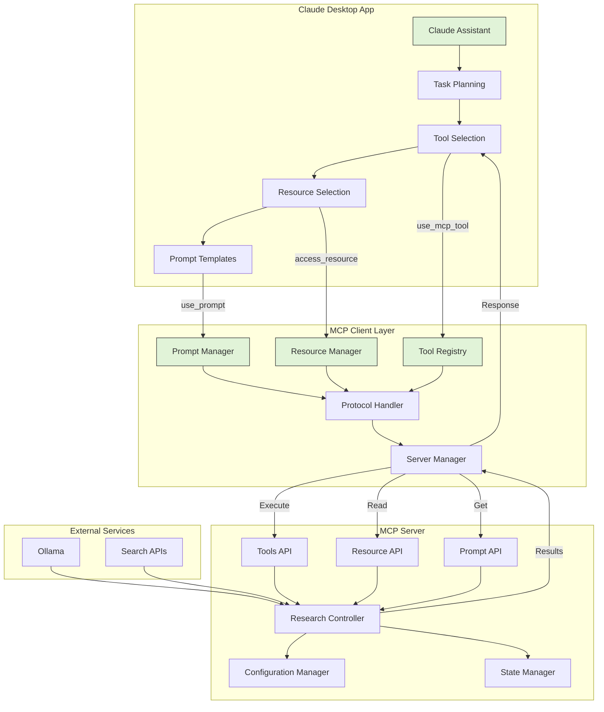

# MCP Server: Ollama Deep Researcher

This is a Model Context Protocol (MCP) server adaptation of [LangChain Ollama Deep Researcher](https://github.com/langchain-ai/ollama-deep-researcher). It provides the deep research capabilities as MCP tools that can be used within the model context protocol ecosystem, allowing AI assistants to perform in-depth research on topics using local LLMs via Ollama.

## Core Functionality

The server provides research tools that use any LLM hosted by [Ollama](https://ollama.com). Given a topic, it will:

1. Generate a web search query
2. Gather web search results via [Tavily](https://www.tavily.com/) or [Perplexity API](https://www.perplexity.ai/hub/faq/pplx-api)
3. Summarize the search results
4. Reflect on the summary to examine knowledge gaps
5. Generate new search queries to address the gaps
6. Iteratively improve the summary through multiple research cycles
7. Provide a final markdown summary with all sources used


## Prerequisites

- Node.js (for running the MCP server)
  - Download and install from https://nodejs.org/
  - Ensure Node.js is added to your system PATH
- Python 3.10 or higher
- Compute (CPU/GPU) capable of running your selected Ollama model
- At least 8GB of RAM for running larger language models
- API keys for search services:
  - Tavily API key (get one at https://tavily.com)
  - Perplexity API key (get one at https://perplexity.ai)

Make sure you can run Node.js and npm from your terminal/command prompt. You can verify your installations with:

```bash
node --version
npm --version
python --version
```

If these commands fail, you may need to:
1. Restart your terminal/computer after installation
2. Add Node.js to your system PATH:
   - Windows: Edit system environment variables → Environment Variables → Path → Add Node.js installation directory
   - macOS/Linux: Usually handled by the installer

## Installation

1. Download and install [Ollama](https://ollama.com/download) for your platform

2. Clone this repository and install dependencies:
```bash
git clone https://github.com/Cam10001110101/mcp-server-ollama-deep-researcher
cd mcp-server-ollama-deep-researcher
npm install
```

3. Install Python dependencies:

For Windows:
```bash
# Using pip
pip install langgraph langchain-core langchain-ollama tavily-python pplx

# Or using uv (recommended)
uv pip install langgraph langchain-core langchain-ollama tavily-python pplx
```

For macOS/Linux:
```bash
# Using pip
pip3 install langgraph langchain-core langchain-ollama tavily-python pplx

# Or using uv (recommended)
uv pip install langgraph langchain-core langchain-ollama tavily-python pplx
```

4. Build the TypeScript code:
```bash
npm run build
```

5. Pull a local LLM from [Ollama](https://ollama.com/search):
```bash
ollama pull deepseek-r1:8b
```

## Client Configuration

Add the server to your MCP client configuration:

For Claude Desktop App:
- macOS: `~/Library/Application Support/Claude/claude_desktop_config.json`
- Windows: `%APPDATA%\Claude\claude_desktop_config.json`

For Cline (VS Code Extension):
- Windows: `%APPDATA%\Code\User\globalStorage\saoudrizwan.claude-dev\settings\cline_mcp_settings.json`
- macOS: `~/Library/Application Support/Code/User/globalStorage/saoudrizwan.claude-dev/settings/cline_mcp_settings.json`
- Linux: `~/.config/Code/User/globalStorage/saoudrizwan.claude-dev/settings/cline_mcp_settings.json`

For Windows:
```json
{
  "mcpServers": {
    "ollama-deep-researcher": {
      "command": "node",
      "args": ["C:\\path\\to\\build\\index.js"],
      "env": {
        "TAVILY_API_KEY": "your-tavily-key",
        "PERPLEXITY_API_KEY": "your-perplexity-key",
        "PYTHONPATH": "C:\\path\\to\\src",
        "PYTHONUNBUFFERED": "1"
      },
      "disabled": false,
      "autoApprove": []
    }
  }
}
```

For macOS/Linux:
```json
{
  "mcpServers": {
    "ollama-deep-researcher": {
      "command": "node",
      "args": ["/path/to/build/index.js"],
      "env": {
        "TAVILY_API_KEY": "your-tavily-key",
        "PERPLEXITY_API_KEY": "your-perplexity-key",
        "PYTHONPATH": "/path/to/src",
        "PYTHONUNBUFFERED": "1"
      },
      "disabled": false,
      "autoApprove": []
    }
  }
}
```

## Available Tools

### Configure

- **maxLoops**: Number of research iterations (1-5)
- **llmModel**: Ollama model to use (e.g., "deepseek-r1:1.5b", "llama3.2")
- **searchApi**: Search API to use ("perplexity" or "tavily")

Configure research parameters.
```json
{
  "name": "configure",
  "arguments": {
    "maxLoops": 3,
    "llmModel": "deepseek-r1:1.5b",
    "searchApi": "tavily"
  }
}
```

### Research
Research any topic using web search and LLM synthesis.
```json
{
  "name": "research",
  "arguments": {
    "topic": "Austin LangChain, aimug.org"
  }
}
```

### Get status
Get the current status of ongoing research.
```json
{
  "name": "get_status",
  "arguments": {
    "_dummy": "dummy"
  }
}
```

## Prompting

### Using the Default Search API, Model, and Max Iterations (loops)
Prompt Example: "research AI-First Applications"
### Change Default Config and Start Research
Synatx: `configure with <searchapi> and <model> then research <topic>`  
Prompt Example: "Configure with perplexity and deepseek-r1:8b then research AI-First Applications"

# The Ollama Research Workflow

The research process is inspired by [IterDRAG](https://arxiv.org/html/2410.04343v1#:~:text=To%20tackle%20this%20issue%2C%20we,used%20to%20generate%20intermediate%20answers.). This approach decomposes a query into sub-queries, retrieves documents for each one, answers the sub-query, and then builds on the answer by retrieving docs for the second sub-query.

The process works as follows:

1. Given a user-provided topic, use a local LLM (via [Ollama](https://ollama.com/search)) to generate a web search query
2. Uses a search engine (configured for [Tavily](https://www.tavily.com/)) to find relevant sources
3. Uses LLM to summarize the findings from web search related to the user-provided research topic
4. Then, it uses the LLM to reflect on the summary, identifying knowledge gaps
5. It generates a new search query to address the knowledge gaps
6. The process repeats, with the summary being iteratively updated with new information from web search
7. It will repeat down the research rabbit hole
8. Runs for a configurable number of iterations

## Outputs

The output is a markdown file containing the research summary, with citations to all sources used during the research process.

All sources gathered during research are preserved and can be referenced in the final output:

## System Integration Overview



## Troubleshooting

Here are solutions to common issues you might encounter:

### Ollama Connection Issues

- Make sure Ollama is running: Execute `ollama list` in your terminal
- Try running ollama in terminal mode by closing the app (System Tray/Menu Bar), and executing `ollama serve`
- Check if Ollama is accessible at `localhost:11434`, `0.0.0.0:11434`, or `127.0.0.1:11434`

### API Key Issues

- Verify your API key is correctly set in the configuration file
- Verify your path arg points to the actual location of the index.js in this repo
- Ensure there are no extra spaces or quotes around the API key
- Check if your API key has sufficient credits/permissions

### MCP Server Issues

- Use the MCP Inspector for debugging:
```bash
npx @modelcontextprotocol/inspector node path/to/server/index.js --model llama3.2 --max-loops 3 --search-api tavily
```

### Build Issues

- If `npm run build` fails with "'node' is not recognized":
  1. Ensure Node.js is properly installed
  2. Add Node.js to your system PATH:
     - Windows: Edit system environment variables → Environment Variables → Path → Add Node.js installation directory
     - macOS/Linux: Usually handled by the installer
  3. Restart your terminal/computer
  4. Try running `node --version` to verify the installation

### Python Issues

Windows:
- Ensure Python is in your PATH
- Try using `python` instead of `python3`
- Check if pip is installed: `python -m pip --version`

macOS/Linux:
- Use `python3` instead of `python`
- Check if pip is installed: `python3 -m pip --version`
- You may need to install pip: `sudo apt install python3-pip` (Ubuntu/Debian) or `brew install python3` (macOS)

## Error Handling

The server provides clear error messages for:
- Missing or invalid API keys
- Configuration issues
- Search API problems
- LLM processing errors

## Enhancements Needed
- Tighter re-integration and validation of langgraph for additional interesting use cases.

## Architecture

For detailed information about the server's architecture and implementation, see [.context/index.md](.context/index.md).
